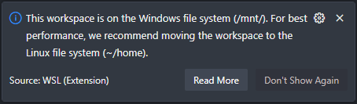

As a Linux\* user, the Windows Subsystem for Linux (WSL) is an indispensable part of my daily workflow.

\*yes, I know that Linux is the kernel, GNU/Linux, yadda yadda

# The Beginning

Like most people (probably), I started with one distro, and just stored all the data in there.
And that worked fine, just fine, for a while. But then I ran into issues where some systems I deploy to had very old versions of things like glibc (or something like that, I can't be bothered about the specifics).
So then I created another distro, and used that when I needed to compile the code for that one system, copying code to it when needed.

But that was very tedious, and I'd sometimes forget and wonder why the code I _just changed_ didn't seem to work (almost always because I forgot to `git push` on my "main" programming distro, and `git pull` on my "compiler" distro :facepalm:).

# Enter WSL-DataStore

The solution I came up with is... just use another distro. Probably not the ideal solution, but it works. The distro for this doesn't really matter, as long as you can run it under WSL2. That's the only prerequisite for this.

## Init Scripts

There's probably a way to do this with the new [`systemd` support in WSL][wsl-systemd-support], but when I first set it up, I used a dumb bash script and a `.bat` file that would run every time I logged on to Windows

### In WSL-DataStore

In `/init.bash` (it doesn't really matter where this file lives, as long as you know where it is for the batch file on Windows, shown later)

```bash
mkdir -vp /data /mnt/wsl/data
mount -o bind /data /mnt/wsl/data
```

The reason I bind mount `/data` to `/mnt/wsl/data` is that everything under `/mnt/wsl` is shared between all distros in WSL2, allowing the other ("client") distros to access it

### In the Client Distros

In `/etc/fstab`

```fstab
/mnt/wsl/data /data ext4 bind,defaults 0 0
```

I use this `/data` mount point because some software may think that everything under `/mnt/wsl` is on Windows, and has a performance penalty.
This isn't really the case here, but it probably still does have some penalty due to it being bind-mounted twice.
Though I guess if you care about that much about every last bit of performance, you're probably running a bare metal install anyway.
You _might_ be able to get away with using a symbolic link, but I'm not sure what other side effects that might have.

> This workspace is on the Windows file system (/mnt/). For best performance, we recommend moving the workspace to the Linux file system (~/home).
>
> 

### On Windows

In `%APPDATA%\Microsoft\Windows\Start Menu\Programs\Startup\start-wsl-datastore.bat`

```
C:\Windows\System32\wsl.exe -d WSL-DataStore -- bash /init.bash
C:\Windows\System32\wsl.exe -d ArchLinux -- mount -a
```

The second `mount -a` line is an attempt to work around an annoying bug where when you start your "client" distros (I use Arch, btw), an error in processing fstab results in `/data` not being mounted, which can have many downstream effects (for example, if you have your dotfiles for your shell symlinked to `/data` like I do...).
Though, if the workaround results in the successful mounting of `/data`, then you will see the error message, such as below:

> `Processing fstab with mount -a failed.`
>
> 

# Summary

Ever since the release of WSL2, I use a separate WSL distro to store my data.
Using a few tricks, I am able to share this data across multiple distros easily, allowing me to reduce duplicate data, switch between distros, and recover from catastrophic distro failures.

# Extra Links

- [Microsoft DevBlog post announcing SystemD support availability in WSL][wsl-systemd-support]
- [SystemD WSL concept documentation][wsl-systemd-documentation]

[wsl-systemd-support]: https://devblogs.microsoft.com/commandline/systemd-support-is-now-available-in-wsl/
[wsl-systemd-documentation]: https://learn.microsoft.com/en-us/windows/wsl/systemd
